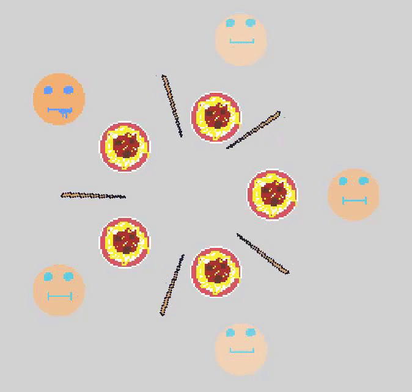

# DiningPhilosophersSim (janzim @NTNU)
A small graphical simulation on the "Dining Philosophers" problem solved using SFML.

Read how it was solved here: https://multicus.com/posts/dining-philosophers-simulation/

The threads file with the problem and core implementation can be found under "dining-philosophers-semaphores.c" : https://github.com/multicus/DiningPhilosophersSim/blob/master/dining-philosophers-semaphores.c
